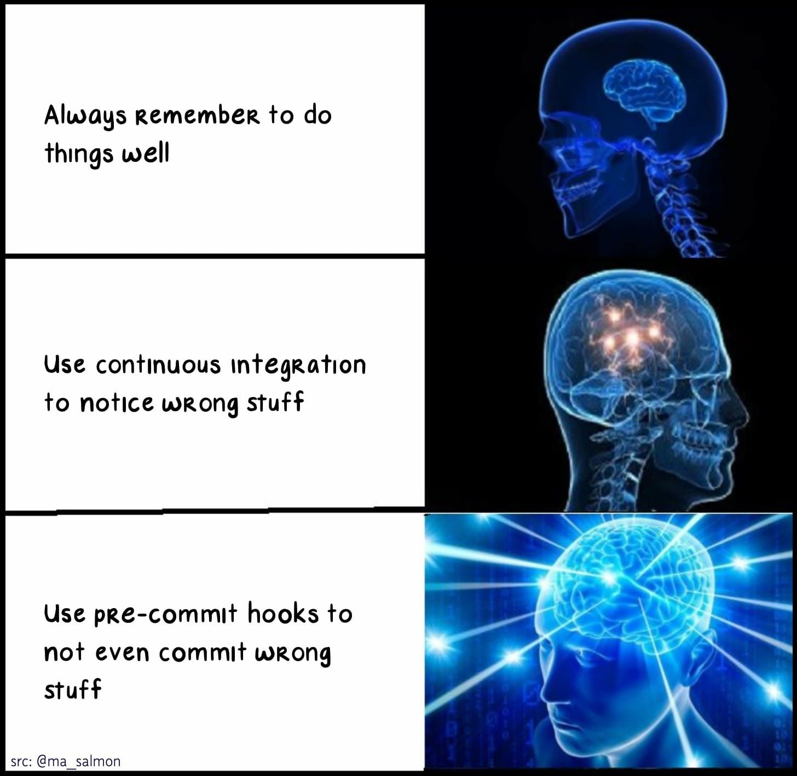
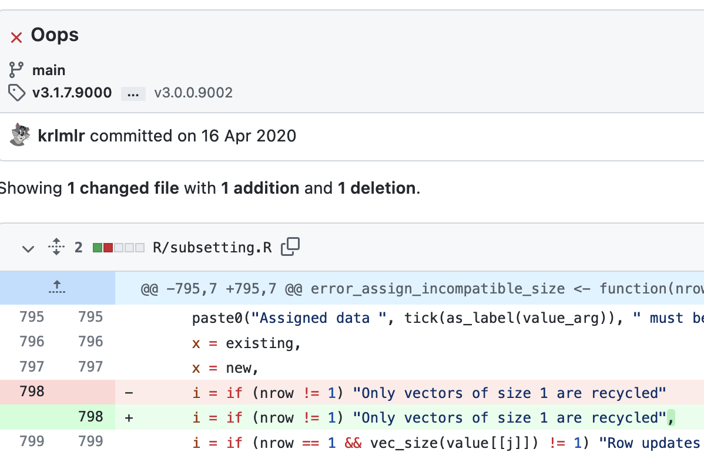

## Trivial problems cost a lot of time


- Fixing code style issues.

- Rendering `README.Rmd`.

- Run `roxygen2::roxygenize()` to generate `.Rd` docs.

- Declare missing dependency in `DESCRIPTION`.

- ...

---

## How to deal with trivial problems


.center[
```{r, out.width="60%", echo=FALSE}

```
]

---

## So what is pre-commit?

- Unit tests for your commits, invoked through `$ git commit`.
- Commit is aborted if:
    - a hook finds a problem.
    - a hook changes a file.
- CLI program (written in Python).
- Supports hooks in many languages.

---

## And what is {precommit}?

R package:

* {usethis}-like functionality for setup of pre-commit.

* Implementation of R hooks.
  
---


## What can pre-commit do for you?

* Save you time 

* Better commits = better code quality

.center[
```{r, out.width="60%", echo=FALSE}

```
]


---

## Why does pre-commit stand out?

- Focus on your code.

- A declarative configuration file for routine checks.

- Locally and remotely. Or just one of the two.

- Dependency isolation.

- No git history convolution.

- The power of the crowd.

- Extensible.

- Standing on the shoulders of giants.

- Independent.


---

## Demo

* Set-up precommit.

* Show hooks in action.

* continuous integration.

* Write your own hooks.

---

### Closing

Learnings 
* What pre-commit is.
* How pre-commit works.
* Local and CI use case.
  
</br>
.center[
```{r, out.width="50%", echo=FALSE}

```
] 

